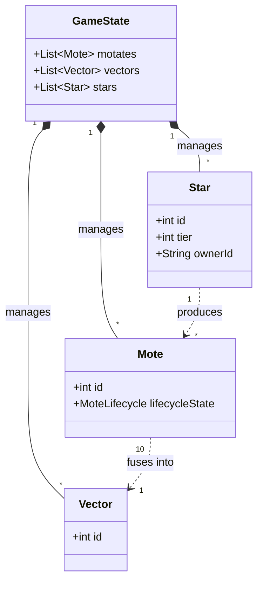

# Data Model Relationships

This document describes the relationships between the core data models in Astro Flux.

## Class Diagram

## Entity Definitions

### GameState
The root container for the entire game state. It is immutable and holds the collections of all active entities.

### Mote
The fundamental resource in the game. Motes are produced by Stars and can be fused to create Vectors.

### Vector
A high-tier unit created from the fusion of exactly 10 Motes. Represents a more powerful force.

### Star
Stationary nodes that serve as the primary production engine. Stars produce Motes over time and can be captured by players.